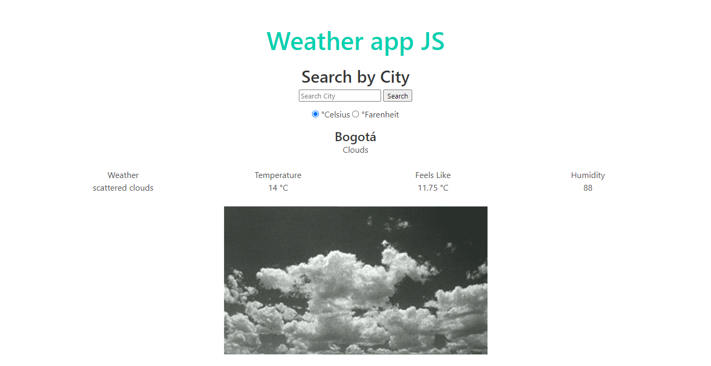

# weather-app
> In this project I build a small page where you can check the weather of a city it also shows temperature, humidity and sensation of temperature, i get those values using an api and another diferent api to get random images. For this project I used webpack and ES6 modules

 

## Built With

- HTML
- CSS
- Bulma
- Javascript
- VScode

## Live Demo

<a href="https://raw.githack.com/julian3493/weather-app/feature/dist/index.html" target="_blank">Live version</a>

## Getting Started

To get a local copy up and running follow these simple example steps.

### Setup

- Clone this repository. Type `git clone https://github.com/julian3493/weather-app.git`
- Navigate to the project folder (weather-app) `cd weather-app`
- Open the `index.html` file into the folder `dist` with the browser `double click on index.html` if you want to see the app running.
- Open the folder weather-app(Step 2) with an editor of your preference if you want to see the code.

### Run tests

```
     npx eslint .
```

## Author
​
👤 **Julian Ramos**
​

[<code></code>](https://github.com/julian3493)
[<code></code>](https://twitter.com/JulianR16893833)
[<code></code>](https://www.linkedin.com/in/julian-ramos-arevalo/)
[<code></code>](mailto:julianramosarevalo@gmail.com)

## 🤝 Contributing

Contributions, issues and feature requests are welcome!

Feel free to check the <a href="https://github.com/julian3493/weather-app/issues"> issues page</a>.

## Show your support

Give a ⭐️ if you like this project!

## Acknowledgments

- <a href="https://www.theodinproject.com/" target="_blank">The Odin Project</a>
- <a href="https://www.stackoverflow.com/" target="_blank">Stackoverflow</a>
- <a href='https://openweathermap.org/'>Open weather</a>
- <a href='https://developers.giphy.com/'>Giphy developers</a>